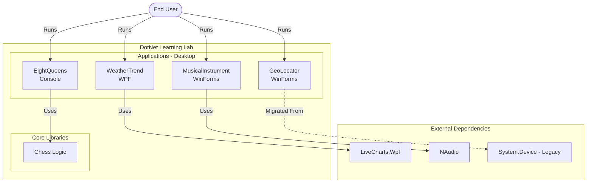

# Architecture Overview

## Solution Structure

The solution follows a standard .NET 10 structure with Central Package Management (CPM).



```
DotNetLearningLab/
├── src/
│   ├── Chess/               # .NET 10 Class Library (Game Logic)
│   ├── EightQueens/         # Console App (Backtracking Algorithm)
│   ├── GeoLocator/          # WinForms App (Windows.Devices.Geolocation)
│   ├── MusicalInstrument/   # WinForms App (NAudio)
│   └── WeatherTrend/        # WPF App (LiveCharts)
├── tests/
│   ├── Chess.Tests/         # xUnit Tests for Chess
│   ├── EightQueens.Tests/   # xUnit Tests for EightQueens
│   └── ...
├── docs/                    # Documentation
├── Directory.Build.props    # Shared Build Properties
├── Directory.Packages.props # CPM Dependencies
└── DotNetLearningLab.sln    # Solution File
```

## Key Technologies

- **Core:** .NET 10 (C# 14)
- **UI Frameworks:** WPF, WinForms
- **Libraries:**
  - `LiveCharts.Wpf` (Charting)
  - `NAudio` (Sound Generation)
  - `Windows.Devices.Geolocation` (GPS/Location)
- **Testing:** xUnit, Coverlet

## Design Principles

- **modernization:** All legacy .NET Framework code has been ported to .NET 10.
- **Dependency Management:** Centralized via `Directory.Packages.props`.
- **Quality Assurance:** CI/CD pipeline enforces build, test, and CodeQL security analysis.
